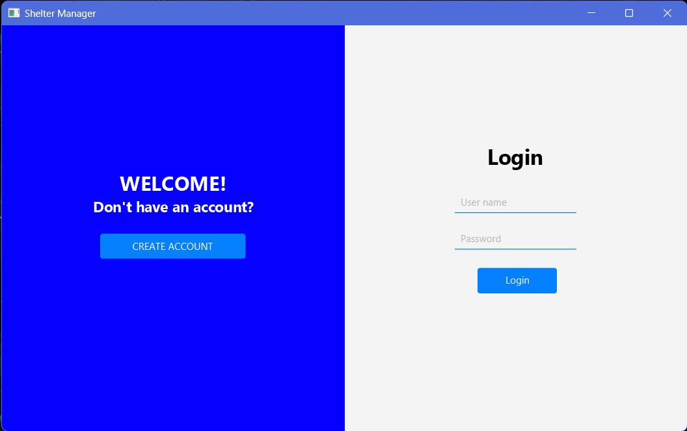
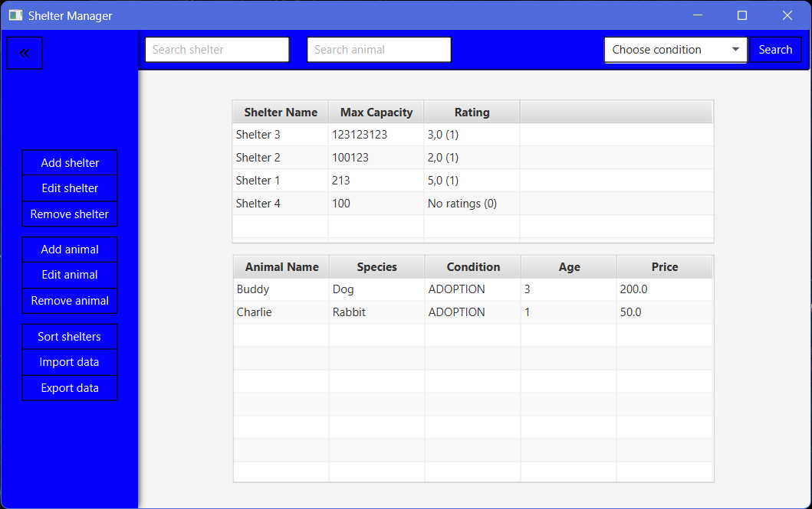

# SHELTER MANAGER

## 📌 1. Project Description

The **Shelter Manager** is a Java application to manage animal shelters. It provides both a **JavaFX GUI** for users to interact with the system and a **Spring Boot API** to allow external access to the same shelter data. The system allows users to manage shelters, animals, and ratings either through the graphical interface or via a RESTful API.

## 🛠 2. Technologies

- **Java**
- **JavaFX**
- **Hibernate** 
- **SQL** 
- **Spring Boot**

## 🤖 3. Features

### 3.1. JavaFX GUI
The JavaFX application provides a user-friendly graphical interface for managing the shelters, animals, and ratings, including features like:
- **Login page** to authenticate users.
- **Admin page** for managing shelters, animals, and other functionalities.
- **User page** for rating shelters and searching shelters and animals.

### 3.2. Spring Boot API
In addition to the JavaFX application, the **Spring Boot API** offers the following capabilities:
- **RESTful API** endpoints for managing shelter data (e.g., add, update, delete shelters and animals).
- **Exposing data** as JSON, which can be consumed by other applications or systems.
- The API allows external clients (e.g., web or mobile applications) to interact with the same shelter data managed through the JavaFX GUI.

## 🖥️ 4. GUI Screenshots

### Login Page

### Admin Page

